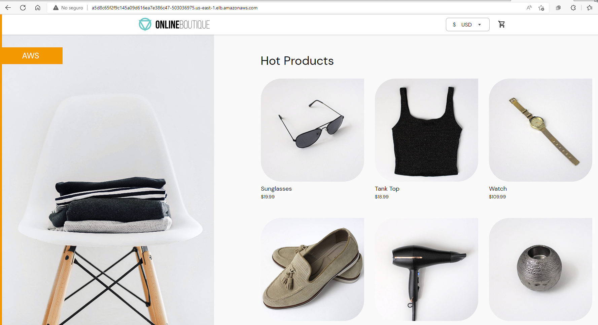
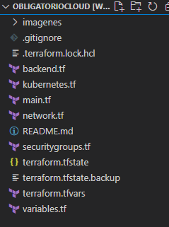
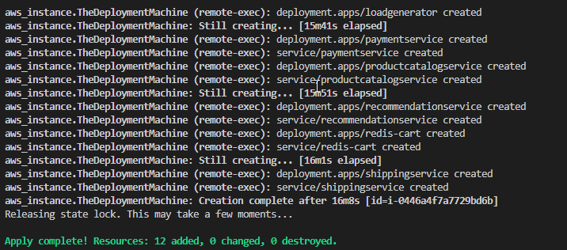
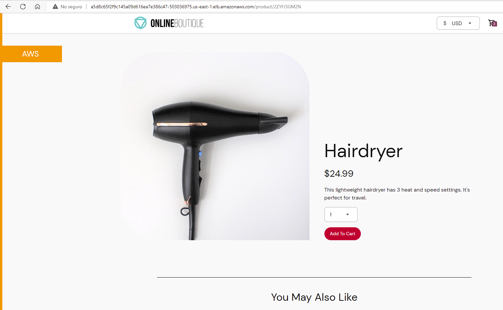
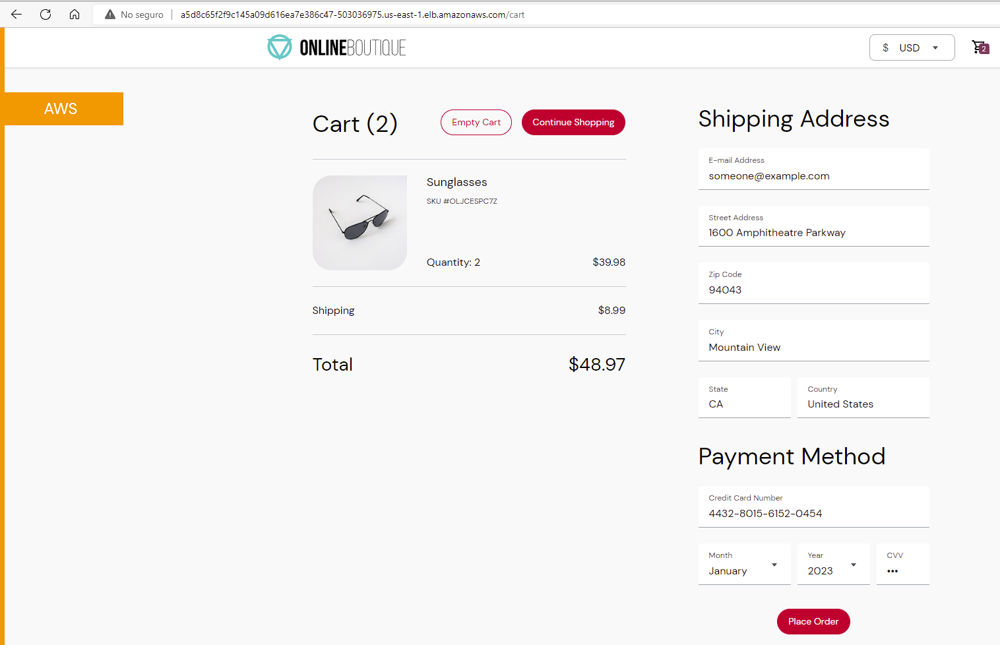
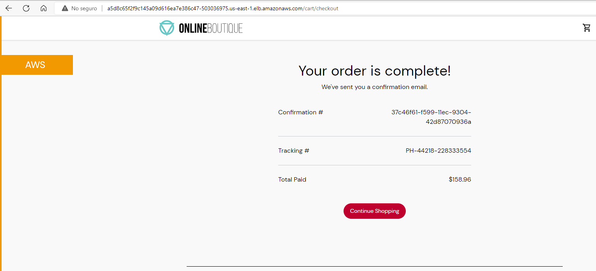

# Implementación de Soluciones Cloud
## _Diagrama de arquitectura_

## _Infraestructura_
- VPC: 10.0.0.0/16
- Subredes publicas: AZa 10.0.0.0 /24 - AZb 10.0.1.0 /24
- Subredes privadas: AZa 10.0.2.0 /24 - AZb 10.0.3.0/24
- Route table: 0.0.0.0 /0 
- Internet Gateway: Se le asigno Route table para su salida a Internet
- EKS Cluster "bitbeat-eks-cluster", con un mínimo de 2 servidores y un máximo de 6 de tipo t3.xlarge
- Repositorio ECR "bitbeat-images", donde se alojarán todas las imágenes creadas con Docker
- BBDD en DynamoDB "tfstate-obligatorio-cloud-ort" para utilizar con el archivo tfstate
- S3 buckets ("tfstate-obligatorio-cloud-ort" y "terraformaa-bucket") los cuales alojaran el primero el archivo tfstate y el segundo se utilizara para descargar keys y sripts necesarios para la implementación
- Se utilizara una instancia EC2 tipo t2.medium con disco de 20Gb "TheDeploymentMachine" la cual se utilizara para deployar toda la infraestructura de la página web
- 
## _Prerequisito_
- Cuenta de AWS con un perfil creado
- Actualizamos las credenciales de AWS Academy en la ruta ~/.aws/credencials
- Generar una key para creación de instancias EC2
- Generar una key para la conexión con github y agregarla en el sitio
- Crear un bucket S3 con el nombre "tfstate-obligatorio-cloud-ort"
- Crear un bucket S3 con el nombre "terraformaa-bucket" y subir los archivos (deployment_scripts/deployment.sh, deployment_scripts/deployment2.sh y claves generadas para github)
- Crear una tabla en DynamoDB con el nombre "tfstate-obligatorio-cloud-ort"
##### Instalar:
- Visual Studio Code
- WSL con Ubuntu preferentemente
- Terraform v1.1.8
- Git

## implementación
Se crean repositorios de git.hub 
https://github.com/AlvinLinux/online-boutique-Obligatorio - Fork del repositorio principal con los archivos para el deployment

- Frontend: Expone un servidor HTTP para servir al sitio web. No requiere registro/inicio de sesión y genera identificadores  de sesión para todos los usuarios automáticamente.
- cartservice: Almacena los artículos en el carrito de compras del usuario en Redis y lo recupera.
- productcatalogservice: Proporciona la lista de productos de un archivo JSON y la capacidad de buscar productos y obtener productos individuales.
- currencyservice: Convierte una cantidad de dinero a otra moneda. Utiliza valores reales obtenidos del Banco Central Europeo. Es el servicio QPS más alto.
- paymentservice: Carga la información de la tarjeta de crédito dada (simulacro) con la cantidad dada y devuelve un ID de transacción.
- shippingservice: Proporciona estimaciones de costos de envío basadas en el carrito de compras. Envía artículos a la dirección dada (simulacro)
- emailservice: Envía a los usuarios un correo electrónico de confirmación de pedido (simulacro).
- checkoutservice: Recupera el carrito del usuario, prepara el pedido y organiza el pago, el envío y la notificación por correo electrónico.
- recommendationservice: Recomienda otros productos en función de lo que se da en el carrito.
- adservice: Proporciona anuncios de texto basados en palabras de contexto dadas.
- loadgenerator: Envía continuamente solicitudes imitando flujos de compras realistas de usuarios al frontend.

https://github.com/AlvinLinux/ObligatorioCloud - Repositorio donde se sube los archivos para la implementación de la infraestructura utilizada con Terraform.
Hacer un git clone con la web del repositorio
    
    git clone git@github.com:AlvinLinux/ObligatorioCloud.git


Una vez descargados los archivos abrimos el repositorio con Visual Studio Code, nos encontraremos con el Código para la creación de la infraestructura:
- [Backend.tf] - Contiene el Código para usar el tfstate con S3 y DynamoDB
- [Kubernetes.tf] - Crea el cluster, worker nodes y ECR.
- [Main.tf] - Contiene el provider a utilizar y crea una instancia en la cual se ejecutarán varios comandos para su configuración.
- [Network.tf] - Crea la VPC y las subredes contenidas dentro de ella, junto con una Internet Gateway y route table.
- [Securitygroups.tf] - Security groups para permitir el acceso por HTTP y SSH.
- [Terraform.tfvars.tf] - Contiene variables específicas.
- [Variables.tf] - Contiene variables por default.



### Campos a editar:
##### Main.tf
- key_name (linea 17)
- Profile (linea 28, 30, 67, 69)
- source: "/home/<USERNAME>/.aws" (linea 36)
- private_key: ""/home/<USERNAME>/Obligatorio/<clave generada>"" (linea 42, 52)
##### Backend.tf
- Profile (linea 8) 
##### Kubernetes.tf
- role_arn: "arn:aws:iam::<ACCOUNT ID>:role/LabRole" (linea 4)
- node_role_arn: "arn:aws:iam::<ACCOUNT ID>:role/LabRole" (linea 23)
##### terraform.tfvars.tf
- perfil (linea 1)

Corremos terraform plan para asegurarnos de que no hay errores de codigo y se observara que creen los recursos correspondientes satisfactoriamente.
Una vez que confirmamos con el plan que se vana crear todos los recursos necesarios ejecutamos el deployment con ```terraform apply --auto-approve > terraform.log``` para guardar el log de ejecución en la misma carpeta.





# _Desarrollo de la implementación_

Primeramente, se crea la VPC con las subredes indicadas anteriormente junto con el route table e internet gateway.
Posteriormente se creará el cluster junto con los worker nodes group y por último el repositorio de imágenes en ECR.
Finalmente, una vez que todos los recursos fueron creados se crea la instancia con los recursos necesarios (docker, kubectl, git, keys, etc.).
Durante la creación de la instancia se ejecuta un comando para la descarga desde S3 de los scripts (deployment.sh y desployment2.sh) los cuales crearan las imágenes de docker y cargaran posteriormente a un repositorio de ECR. Por ultimo se ira a cada carpeta donde se encuentran los archivos nombrados deployment.yaml los cuales utilizaran las imágenes en este repositorio para luego crear los PODS.

Este proceso puede demorar entre 20 y 30 minutos y no hace falta la intervención del usuario en ningun momento.





