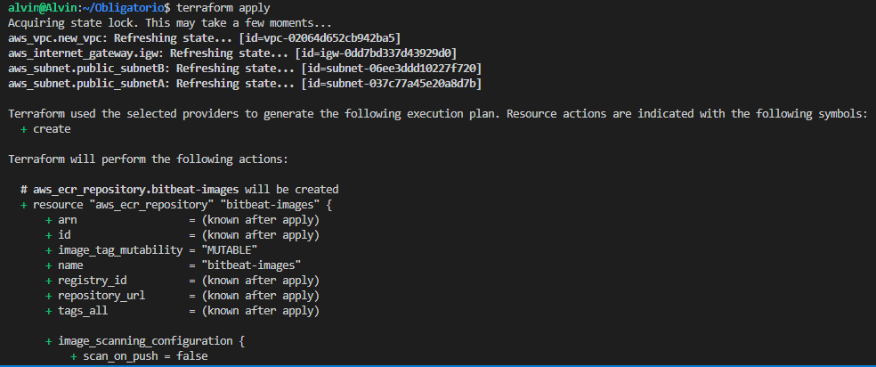

# Implementación de Soluciones Cloud
## _Diagrama de arquitectura_

## _Infraestructura_
- VPC: 10.0.0.0/16
- Subredes publicas: AZa 10.0.0.0 /24 - AZb 10.0.1.0 /24
- Subredes privadas: AZa 10.0.2.0 /24 - AZb 10.0.3.0/24
- Route table: 0.0.0.0 /0 
- Internet Gateway: Se le asigno Route table para su salida a Internet
- EKS Cluster "bitbeat-eks-cluster", con un minimo de 2 servidores y un maximo de 6 de tipo t3.xlarge
- Repositorio ECR "bitbeat-images", donde se alojaran todas las imagenes creadas con Docker
- BBDD en DynamoDB "tfstate-obligatorio-cloud-ort" para utilizar con el archivo tfstate
- S3 buckets ("tfstate-obligatorio-cloud-ort" y "terraformaa-bucket") los cuales alojaran el primero el archivo tfstate y el segundo se utilizara para descargar keys y sripts necesarios para la implementacion
- Se utilizara una instancia EC2 tipo t2.medium con disco de 20Gb "TheDeploymentMachine" la cual se utilizara para deployar toda la infraestructura de la pagina web

## Implementacion
Se crean repositorios de git.hub 
https://github.com/AlvinLinux/online-boutique-Obligatorio - Fork del repositorio principal con los archivos para el deployment

- Frontend: Expone un servidor HTTP para servir al sitio web. No requiere registro/inicio de sesión y genera identificadores  de sesión para todos los usuarios automáticamente.
- cartservice: Almacena los artículos en el carrito de compras del usuario en Redis y lo recupera.
- productcatalogservice: Proporciona la lista de productos de un archivo JSON y la capacidad de buscar productos y obtener productos individuales.
- currencyservice: Convierte una cantidad de dinero a otra moneda. Utiliza valores reales obtenidos del Banco Central Europeo. Es el servicio QPS más alto.
- paymentservice: Carga la información de la tarjeta de crédito dada (simulacro) con la cantidad dada y devuelve un ID de transacción.
- shippingservice: Proporciona estimaciones de costos de envío basadas en el carrito de compras. Envía artículos a la dirección dada (simulacro)
- emailservice: Envía a los usuarios un correo electrónico de confirmación de pedido (simulacro).
- checkoutservice: Recupera el carrito del usuario, prepara el pedido y organiza el pago, el envío y la notificación por correo electrónico.
- recommendationservice: Recomienda otros productos en función de lo que se da en el carrito.
- adservice: Proporciona anuncios de texto basados en palabras de contexto dadas.
- loadgenerator: Envía continuamente solicitudes imitando flujos de compras realistas de usuarios al frontend.

https://github.com/AlvinLinux/ObligatorioCloud - Repositorio donde se subio los archivos para la implementacion de la infraestructura utilizada con Terraform.
Hacer un git clone con la web del repositorio
    
    git clone git@github.com:AlvinLinux/ObligatorioCloud.git

Una vez descargados los archivos abrimos el repositorio con Visual Studio Code.
Actualizamos las credenciales de AWS Academy en la ruta ~/.aws/credencials
Corremos terraform plan para asegurarnos de que no hay errores de codigo y se observara que creen los recursos correspondientes
Luego corremos el deployment con terraform apply y confirmamos con yes

# _Desarrollo de la implementacion_

Primeramente se crea la VPC con las subredes indicadas anteriormente junto con el route table e internet gateway.
Posteriormente se creara el cluster junto con los worker nodes group y por ultimo el repositorio de imagenes en ECR.
Finalmente una vez que todos los recursos fueron creados se crea la instancia con los recursos necesarios (docker, kubectl, git, keys, etc.) para generar las imagenes y pods.

Este proceso puede demorar entre 20 y 30 minutos y no hace falta la intervencion del usuario en ningun momento.
